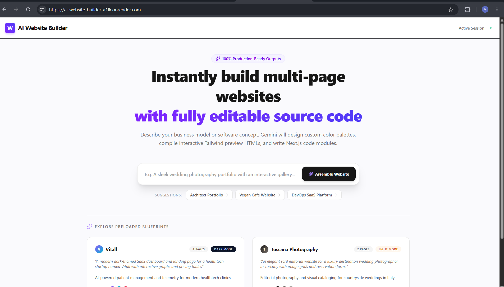
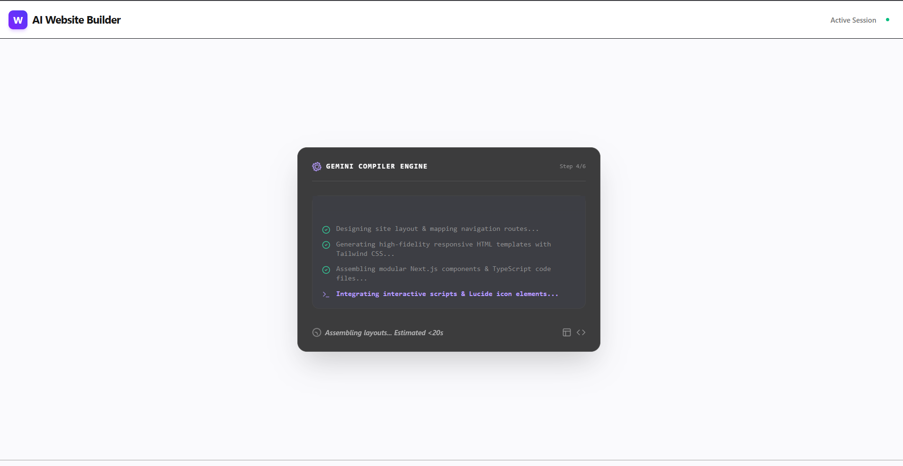
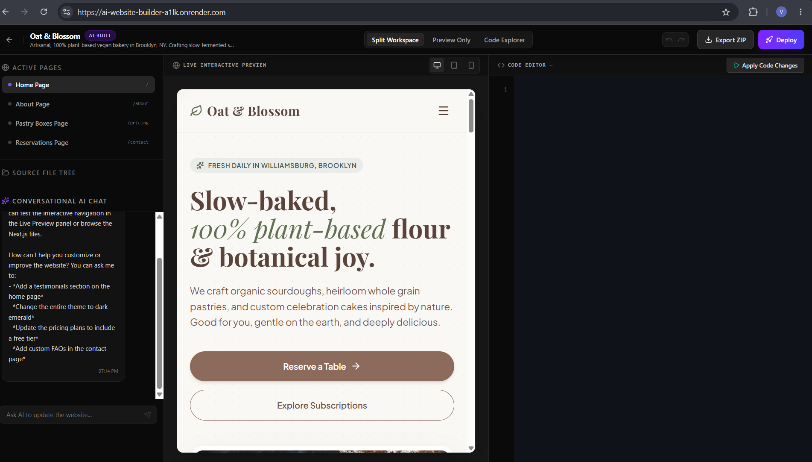
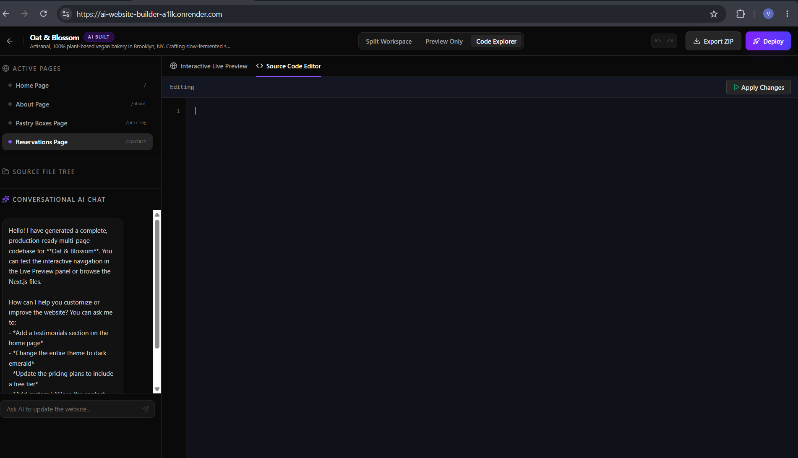

<div align="center">

# 🚀 PromptCraft AI

### Transform ideas into production-ready websites using AI.

Generate beautiful, responsive, multi-page websites from simple natural language prompts using Google Gemini AI.

---
## 🌐 Live Demo

🔗 **Live Website:** https://ai-website-builder-a1lk.onrender.com

> Experience PromptCraft AI live and generate responsive websites from natural language prompts.

---


</div>

---

# 📌 Overview

PromptCraft AI is an AI-powered Website Builder that transforms natural language prompts into modern, responsive, production-ready websites.

Instead of manually writing HTML, CSS, React, and TypeScript, users simply describe their idea, and PromptCraft AI generates a complete website with multiple pages, reusable components, and editable source code.

This project was built as a portfolio project to explore modern AI-assisted web development using Google's Gemini AI.

---

# ✨ Features

## 🤖 AI Website Generation

- Generate websites using natural language
- Understand business ideas automatically
- Multi-page website generation
- Professional layouts

---

## 🎨 Modern UI

- Premium SaaS-inspired interface
- Responsive Design
- Mobile First
- Dark & Light Mode
- Beautiful typography
- Smooth animations

---

## 💬 AI Editing

Modify websites using conversational AI.

Examples:

- Add Testimonials
- Change Theme
- Add Pricing Section
- Create Dashboard
- Update Colors

---

## 👨‍💻 Developer Features

- Live Preview
- Code Explorer
- Editable Source Code
- ZIP Export
- AI Chat
- Multi-page Navigation
- Project Structure Generator

---

# 🛠 Tech Stack

## Frontend

- React
- TypeScript
- Tailwind CSS
- Vite
- Framer Motion
- shadcn/ui
- Lucide Icons

---

## Backend

- Node.js
- Express

---

## AI

- Google Gemini API

---

## Version Control

- Git
- GitHub

---

# 📁 Project Structure

```text
<div align="center">

# 🚀 PromptCraft AI

### Transform ideas into production-ready websites using AI.

Generate beautiful, responsive, multi-page websites from simple natural language prompts using Google Gemini AI.

---


</div>

---

# 📌 Overview

PromptCraft AI is an AI-powered Website Builder that transforms natural language prompts into modern, responsive, production-ready websites.

Instead of manually writing HTML, CSS, React, and TypeScript, users simply describe their idea, and PromptCraft AI generates a complete website with multiple pages, reusable components, and editable source code.

This project was built as a portfolio project to explore modern AI-assisted web development using Google's Gemini AI.

---

# ✨ Features

## 🤖 AI Website Generation

- Generate websites using natural language
- Understand business ideas automatically
- Multi-page website generation
- Professional layouts

---

## 🎨 Modern UI

- Premium SaaS-inspired interface
- Responsive Design
- Mobile First
- Dark & Light Mode
- Beautiful typography
- Smooth animations

---

## 💬 AI Editing

Modify websites using conversational AI.

Examples:

- Add Testimonials
- Change Theme
- Add Pricing Section
- Create Dashboard
- Update Colors

---

## 👨‍💻 Developer Features

- Live Preview
- Code Explorer
- Editable Source Code
- ZIP Export
- AI Chat
- Multi-page Navigation
- Project Structure Generator

---

# 🛠 Tech Stack

## Frontend

- React
- TypeScript
- Tailwind CSS
- Vite
- Framer Motion
- shadcn/ui
- Lucide Icons

---

## Backend

- Node.js
- Express

---

## AI

- Google Gemini API

---

## Version Control

- Git
- GitHub

---

# 📁 Project Structure

```text
ai-website-builder/

├── src/
│   ├── components/
│   ├── server/
│   ├── utils/
│   ├── App.tsx
│   ├── main.tsx
│
├── server.ts
├── package.json
├── tsconfig.json
├── vite.config.ts
├── README.md
└── .env.example
```

---

# 🚀 Getting Started

## Clone Repository

```bash
git clone https://github.com/VasuNakka/ai-website-builder.git
```

---

## Open Project

```bash
cd ai-website-builder
```

---

## Install Dependencies

```bash
npm install
```

---

## Create Environment File

Create a `.env` file in the project root.

```env
GEMINI_API_KEY=YOUR_GEMINI_API_KEY
APP_URL=http://localhost:3000
```

---

## Run the Project

```bash
npm run dev
```

---

Open:

```
http://localhost:3000
```

---

# 📸 Screenshots

## 🏠 Home Page



---

## ⚡ AI Website Generation



---

## 🌐 Generated Website



---

## 💻 Code Explorer



---

# 🚀 Roadmap

## Completed

- [x] AI Website Generation
- [x] Multi-page Website Creation
- [x] Live Preview
- [x] AI Chat Editing
- [x] Code Explorer
- [x] ZIP Export
- [x] Responsive UI

---

## In Progress

- [ ] Fix Generated Website Routing
- [ ] Working Contact Forms
- [ ] Better AI Validation
- [ ] Route Auto Generation

---

## Upcoming Features

- [ ] Authentication
- [ ] Dashboard
- [ ] Save Projects
- [ ] GitHub Export
- [ ] One-click Deployment
- [ ] MCP Integration
- [ ] AI Image Generation
- [ ] Team Collaboration
- [ ] Template Marketplace

---

# ⚠ Current Limitations

Currently, some generated websites may require manual refinement.

Known limitations:

- Some generated buttons require additional routing logic.
- Contact forms require backend integration.
- Generated projects may require manual refinement for production deployment.

These improvements are part of the future roadmap.

---

# 🤝 Contributing

Contributions are welcome.

If you'd like to improve PromptCraft AI:

1. Fork the repository.
2. Create a new feature branch.
3. Commit your changes.
4. Submit a Pull Request.

---

# ⭐ Support

If you like this project,

please consider giving it a ⭐ on GitHub.

It helps support future development.

---

# 👨‍💻 Author

## Vasu Nakka

Computer Science Engineering Student

AI & Full Stack Web Developer

GitHub:

https://github.com/VasuNakka

---

# 📄 License

This project is created for educational, learning, and portfolio purposes.


├── src/
│   ├── components/
│   ├── server/
│   ├── utils/
│   ├── App.tsx
│   ├── main.tsx
│
├── server.ts
├── package.json
├── tsconfig.json
├── vite.config.ts
├── README.md
└── .env.example
```

---

# 🚀 Getting Started

## Clone Repository

```bash
git clone https://github.com/VasuNakka/ai-website-builder.git
```

---

## Open Project

```bash
cd ai-website-builder
```

---

## Install Dependencies

```bash
npm install
```

---

## Create Environment File

Create a `.env` file in the project root.

```env
GEMINI_API_KEY=YOUR_GEMINI_API_KEY
APP_URL=http://localhost:3000
```

---

## Run the Project

```bash
npm run dev
```

---

Open:

```
http://localhost:3000
```

---

# 📸 Screenshots

> Screenshots will be added soon.

---

# 🚀 Roadmap

## Completed

- [x] AI Website Generation
- [x] Multi-page Website Creation
- [x] Live Preview
- [x] AI Chat Editing
- [x] Code Explorer
- [x] ZIP Export
- [x] Responsive UI

---

## In Progress

- [ ] Fix Generated Website Routing
- [ ] Working Contact Forms
- [ ] Better AI Validation
- [ ] Route Auto Generation

---

## Upcoming Features

- [ ] Authentication
- [ ] Dashboard
- [ ] Save Projects
- [ ] GitHub Export
- [ ] One-click Deployment
- [ ] MCP Integration
- [ ] AI Image Generation
- [ ] Team Collaboration
- [ ] Template Marketplace

---

# ⚠ Current Limitations

Currently, some generated websites may require manual refinement.

Known limitations:

- Some generated buttons require additional routing logic.
- Contact forms require backend integration.
- Generated projects may require manual refinement for production deployment.

These improvements are part of the future roadmap.

---

# 🤝 Contributing

Contributions are welcome.

If you'd like to improve PromptCraft AI:

1. Fork the repository.
2. Create a new feature branch.
3. Commit your changes.
4. Submit a Pull Request.

---

# ⭐ Support

If you like this project,

please consider giving it a ⭐ on GitHub.

It helps support future development.

---

# 👨‍💻 Author

## Vasu Nakka

Computer Science Engineering Student

AI & Full Stack Web Developer

GitHub:

https://github.com/VasuNakka

---

# 📄 License

This project is created for educational, learning, and portfolio purposes.
